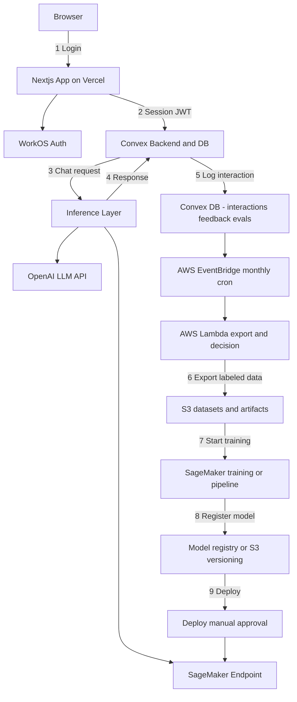

# Philosopher Agent

An AI assistant that responds in the voice of a specific ethical framework (starting with Adlerian philosophy). The system is designed for practical CI/CD exposure while keeping human review and safety in the loop.

## System Architecture (Mermaid)

## Components
1) Frontend: Next.js (Vercel)
- UI: chat interface, feedback buttons, login/logout
- Calls Convex for:
  - sendMessage()
  - submitFeedback()
  - getConversationHistory()
- Key pages:
  - /login -> WorkOS redirect
  - /app/chat -> main chat
  - /app/settings -> optional persona config + privacy notice

2) Auth: WorkOS
- Handles OAuth/SSO login
- Provides session token / user identity to Next.js
- Next.js passes identity to Convex (JWT or session claims)
- Keep it simple: one stable user_id + email

3) Backend + DB: Convex
- Stores users, conversations, messages, feedback
- Orchestrates inference calls (Convex actions for external API calls)
- Enforces auth checks on all mutations/queries
- Provides admin endpoints to export training data

4) Inference Layer (two phases)
- Phase 1 (MVP): Hosted LLM API via Convex action generateAdlerResponse()
- Phase 2: SageMaker endpoint (POST /invocations), with rollout control via config

## Data Model (Convex Tables)
- users: userId, email, createdAt
- conversations: conversationId, userId, title, createdAt
- messages: messageId, conversationId, userId, role, content, createdAt, modelVersion, promptTemplateVersion
- interactions: interactionId, conversationId, userId, userMessageId, assistantMessageId, retrievalUsed, latencyMs, tokensIn, tokensOut, createdAt
- feedback: feedbackId, interactionId, userId, rating, comment, label, createdAt
- datasets (optional): datasetId, type, s3Uri, createdAt, sourceWindow
- models (optional): modelVersion, deployed, notes, createdAt

## Feedback-Driven Training (Practical Default)
- Train only on your own labeled interaction pairs
- Positive: rating = +1
- Negative: rating = -1 (optionally used for preference training later)
- Dataset rule: include interactions with explicit ratings; for negatives, prefer >= 5 word comments
- Keep a stable, hand-curated eval set

## AWS Automation
- EventBridge monthly cron triggers Lambda export_and_train
- Lambda:
  - Call Convex adminExportLabeledData(startDate, endDate)
  - Build JSONL dataset and upload to S3
  - Decide whether to retrain (e.g., >= 200 new labels or neg_rate > threshold)
  - Start SageMaker training job or pipeline
- Training outputs to s3://<bucket>/models/adler/<modelVersion>/
- Register model via SageMaker Model Registry or an S3 model manifest + Convex models table
- Deploy with manual approval first; optional auto-deploy if evals pass

## CI/CD (GitHub + Greptile + Vercel + Convex)
- PR checks: lint, typecheck, test, convex validate/schema
- Greptile review comments on PRs
- Deploy on merge to main:
  - Vercel deploy
  - Convex deploy
- If adding Postgres later: Prisma migrations in a post-merge workflow

## Notes and Guardrails
- Feature flag to switch between OpenAI and SageMaker inference.
- Manual approval before deploying new model versions.
- Rate limiting and abuse protections at the API layer.
- Basic observability (latency, errors, cost).
- Data retention policy for stored interactions.
- Visible disclaimer: "This is an AI assistant inspired by Adlerian individual psychology; not medical advice."

## Phased Roadmap
### Phase 1: MVP (OpenAI-backed)
- Next.js app with WorkOS auth
- Convex backend for messages + logs
- Inference via OpenAI API
- CI pipeline: lint + tests + build

### Phase 2: Data + Evaluation
- Interaction logging + feedback
- Eval sets for quality checks
- Scheduled export to S3

### Phase 3: Fine-tuning + SageMaker
- Training pipeline
- Model registry
- Manual deploy to endpoint

